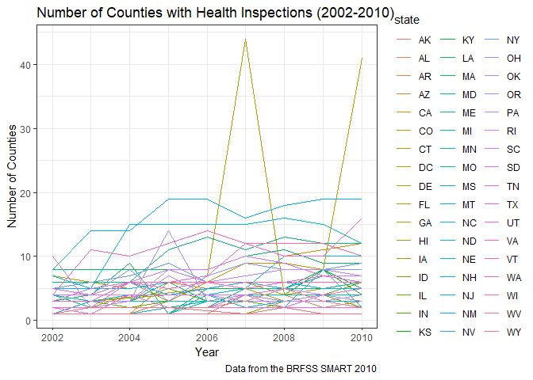
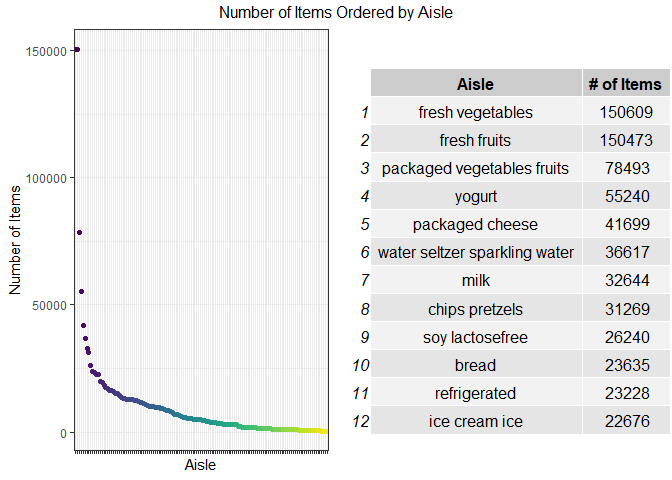

p8105\_hw3\_alc2279
================
Annie Clark
October 12, 2018

Problem 0
=========

This “problem” focuses on structure of your submission, especially the use git and GitHub for reproducibility, R Projects to organize your work, R Markdown to write reproducible reports, relative paths to load data from local files, and reasonable naming structures for your files.

To that end:

-   create a public GitHub repo + local R Project; we suggest naming this repo / directory p8105\_hw3\_YOURUNI (e.g. p8105\_hw3\_ajg2202 for Jeff), but that’s not required
-   create a single .Rmd file named p8105\_hw3\_YOURUNI.Rmd that renders to github\_document

Your solutions to Problems 1, 2, and 3 should be implemented in your .Rmd file, and your git commit history should reflect the process you used to solve these Problems.

For this Problem, we will assess adherence to the instructions above regarding repo structure, git commit history, and whether we are able to knit your .Rmd to ensure that your work is reproducible. Adherence to appropriate styling and clarity of code will be assessed in Problems 1+ using the homework style rubric.

This homework includes figures; the readability of your embedded plots (e.g. font sizes, axis labels, titles) will be assessed in Problems 1+.

``` r
library(tidyverse)
```

    ## -- Attaching packages ------------------------------------------------------ tidyverse 1.2.1 --

    ## v ggplot2 3.0.0     v purrr   0.2.5
    ## v tibble  1.4.2     v dplyr   0.7.6
    ## v tidyr   0.8.1     v stringr 1.3.1
    ## v readr   1.1.1     v forcats 0.3.0

    ## -- Conflicts --------------------------------------------------------- tidyverse_conflicts() --
    ## x dplyr::filter() masks stats::filter()
    ## x dplyr::lag()    masks stats::lag()

``` r
library(p8105.datasets)

theme_set(theme_bw() + theme(legend.position = "bottom"))
```

Problem 1
=========

Part 1: Load and tidy the data
------------------------------

### Prompt

This problem uses the BRFSS data. DO NOT include this dataset in your local data directory; instead, load the data from the p8105.datasets package.

First, do some data cleaning:

-   format the data to use appropriate variable names;
-   focus on the “Overall Health” topic
-   include only responses from “Excellent” to “Poor”
-   organize responses as a factor taking levels from “Excellent” to “Poor”

### Response

``` r
brfss_data = brfss_smart2010 %>% 
  janitor::clean_names() %>% 
  rename(state = locationabbr, state_county = locationdesc, proportion = data_value) %>% 
  filter(topic == "Overall Health", 
         response %in% c("Excellent", "Very good", "Good", "Fair", "Poor")) %>% 
  select(-(class:question), -sample_size, -(confidence_limit_low:geo_location)) %>% 
  mutate(response = forcats::fct_relevel(response, c("Excellent", 
                                                     "Very good", 
                                                     "Good", 
                                                     "Fair", 
                                                     "Poor"))) %>% 
  arrange(response)
```

Part 2: Answer some questions
-----------------------------

Using this dataset, do or answer the following (commenting on the results of each):

### Prompt

-   In 2002, which states were observed at 7 locations?

### Response

``` r
brfss_data %>% 
  filter(year == "2002") %>% 
  group_by(state) %>% 
  summarize(n_locations = n_distinct(state_county)) %>% 
  filter(n_locations == 7) %>% 
  pull(state)
```

    ## [1] "CT" "FL" "NC"

The states that had 7 counties with observed health inspection observations in 2002 are Connecticut, Florida and North Carolina.

### Prompt

-   Make a “spaghetti plot” that shows the number of observations in each state from 2002 to 2010.

### Response

``` r
## spaghetti plot
brfss_data %>% 
  group_by(year, state) %>% 
  summarize(n_locations = n_distinct(state_county)) %>% 
  ggplot(aes(x = year, y = n_locations, color = state)) + 
    geom_path() + 
    labs(
      title = "Number of Counties with Health Inspections (2002-2010)",
      x = "Year",
      y = "Number of Counties",
      caption = "Data from the BRFSS SMART 2010"
    ) + 
    theme(legend.position = "right") 
```



``` r
## table to help interpret plot
inspections_state_year = 
  brfss_data %>% 
  group_by(year, state) %>% 
  summarize(n_locations = n_distinct(state_county)) %>% 
  arrange(desc(n_locations)) %>% 
  rename(Year = year, State = state, "Number of Counties" = n_locations) %>% 
  head(12)

knitr::kable(inspections_state_year)
```

|  Year| State |  Number of Counties|
|-----:|:------|-------------------:|
|  2007| FL    |                  44|
|  2010| FL    |                  41|
|  2005| NJ    |                  19|
|  2006| NJ    |                  19|
|  2009| NJ    |                  19|
|  2010| NJ    |                  19|
|  2008| NJ    |                  18|
|  2007| NJ    |                  16|
|  2008| NC    |                  16|
|  2010| TX    |                  16|
|  2004| NC    |                  15|
|  2005| NC    |                  15|

This plot shows that throughout the years, most states have less than 10 observations. There does appear to be a slight increase in observations; while in 2002, most states had less than 10 observations, in 2010, most states had less than 15 observations.

There are a few states with consistently more observations throughout the years, like NJ and NC (the top blue lines). While Florida does not consistently have a high number of observations throughout the years, the state has significantly more observations in 2007 and 2010. I included a table of the top 20 number of observations throughout the years to help in identifying which line is associated with which state.

### Prompt

-   Make a table showing, for the years 2002, 2006, and 2010, the mean and standard deviation of the proportion of “Excellent” responses across locations in NY State.

``` r
excellent_responses_data = 
  brfss_data %>% 
  group_by(state_county) %>% 
  filter(year %in% c("2002", "2006", "2010"),
         state == "NY",
         response == "Excellent") %>%
  summarize(excellent_mean = mean(proportion, na.rm = TRUE), 
            excellent_sd = sd(proportion, na.rm = TRUE)) %>% 
  rename("State and County" = state_county, "Mean of Excellent Ratings" = excellent_mean, "SD of Excellent Ratings" = excellent_sd)

knitr::kable(excellent_responses_data)
```

| State and County        |  Mean of Excellent Ratings|  SD of Excellent Ratings|
|:------------------------|--------------------------:|------------------------:|
| NY - Bronx County       |                   17.60000|                      NaN|
| NY - Erie County        |                   17.20000|                      NaN|
| NY - Kings County       |                   20.36667|                1.7672955|
| NY - Monroe County      |                   22.40000|                      NaN|
| NY - Nassau County      |                   24.93333|                2.8219379|
| NY - New York County    |                   27.50000|                1.5394804|
| NY - Queens County      |                   19.63333|                1.3576941|
| NY - Suffolk County     |                   24.10000|                3.2787193|
| NY - Westchester County |                   26.45000|                0.6363961|

The nine counties in NY that have reported observations in 2002, 2006 and 2010 have a range of excellent proportions from 17.2 in Erie County to 27.5 in New York County. The counties with no standard deviation are those that only had observations in one year, so the mean is the mean proportion for only that one year.

### Prompt

-   For each year and state, compute the average proportion in each response category (taking the average across locations in a state). Make a five-panel plot that shows, for each response category separately, the distribution of these state-level averages over time.

### Response

``` r
brfss_data %>% 
  group_by(year, state, response) %>% 
  summarize(response_mean = mean(proportion, na.rm = TRUE)) %>% 
  ggplot(aes(x = year, y = response_mean, group = year, color = response)) + 
    geom_boxplot() +
    facet_grid(~response)+ 
    theme(axis.text.x = element_text(angle = 60, hjust = 1),
          legend.position = "none") + 
    labs(
      title = "Average Resturant Health Inspection Proportion by Response and Year",
      x = "Year",
      y = "Average Proportion",
      caption = "Data from the BRFSS SMART 2010"
    ) + 
    viridis::scale_color_viridis(
      name = "Location", 
      discrete = TRUE
    )
```


The distribution of the average proportions throughout the years by state can be seen in this plot. We see that the rating "Very good" has consistently the highest proportions, followed by "Good," "Excellent," "Fair," and then "Poor." This is consistent with what I would expect. There are some outliers in each of the response categories; I would be interested in exploring the outliers that fall below the distribution in the "Excellent" rating (meaning that they are doing worse than the other states) and also the outliers that fall above the average distribution in the "Poor" response (also meaning they are doing worse than the other states).

Problem 2
=========

Part 1: Load the data
---------------------

This problem uses the Instacart data. DO NOT include this dataset in your local data directory; instead, load the data from the p8105.datasets package (it’s called instacart).

``` r
instacart_data = 
  instacart %>% 
  mutate(order_dow = recode(order_dow, "0" = "Monday", 
                            "1" = "Tuesday", 
                            "2" = "Wednesday", 
                            "3" = "Thursday",
                            "4" = "Friday", 
                            "5" = "Saturday", 
                            "6" = "Sunday")) %>% 
  mutate(order_dow = forcats::fct_relevel(order_dow, c("Monday", "Tuesday", "Wednesday",
                                                       "Thursday", "Friday", "Saturday",
                                                       "Sunday")))
```

Part 2: EDA - Describe the data
-------------------------------

### Prompt

The goal is to do some exploration of this dataset. To that end, write a short description of the dataset, noting the size and structure of the data, describing some key variables, and giving illstrative examples of observations.

### Response

The instacart dataset has 1384617 rows and 15 columns in the data. Each row in the dataset includes information about one item that was included in an order. Variables for each include order information (the order in which it was added to the cart, the time/day that the order was placed, if it was a reorder, etc.) and information about the product (which aisle/department it falls in, the product name/id, etc.). Some key variables that I expect to use to further explore the data (not just in this homework) are the product aisle, when the order was placed, whether it was a reorder, and the order number (to look at what basekts look like). A question that I would be interested asking is, "Are items that placed first in to the basket nore likely to be reorder items than subsequent items placed in the basket?." Using the code below, I did a prelimarly inspection of this question and found that it does appear that items added to the cart first tend to be reorder items.

``` r
reorder_add_to_cart_order_data = 
  instacart_data %>% 
  group_by(reordered, add_to_cart_order) %>% 
  summarize(n = n()) %>% 
  spread(key = reordered, value = n) %>% 
  rename("Add to Cart Order" = add_to_cart_order, "Not a Reordered Item" = "0", 
         "Reordered Item" = "1") %>% 
  head(5)

knitr::kable(reorder_add_to_cart_order_data)
```

|  Add to Cart Order|  Not a Reordered Item|  Reordered Item|
|------------------:|---------------------:|---------------:|
|                  1|                 36392|           94817|
|                  2|                 37448|           86916|
|                  3|                 38846|           78150|
|                  4|                 38471|           70492|
|                  5|                 38001|           62744|

Part 3: EDA - Some questions
----------------------------

Then, do or answer the following (commenting on the results of each):

### Prompt

-   How many aisles are there, and which aisles are the most items ordered from?

### Response

``` r
## number of aisles
instacart_data %>% 
  distinct(aisle) %>% ##confirmed that aisles are distinct
  nrow()
```

    ## [1] 134

``` r
## aisles most ordered from
instacart_data %>% 
  group_by(aisle) %>% 
  summarize(n_items = n()) %>% 
  arrange(desc(n_items)) %>% 
  pull(aisle) %>% 
  head(5)
```

    ## [1] "fresh vegetables"           "fresh fruits"              
    ## [3] "packaged vegetables fruits" "yogurt"                    
    ## [5] "packaged cheese"

There are 134 number of aisle and the fresh vegetable, fresh fruit, packaged vegetables fruits, yogurt and packaged cheese aisles have the most items ordered from them.

### Prompt

-   Make a plot that shows the number of items ordered in each aisle. Order aisles sensibly, and organize your plot so others can read it.

### Response

``` r
##install.packages("RGraphics")
library(RGraphics)
```

    ## Loading required package: grid

``` r
library(gridExtra)
```

    ## 
    ## Attaching package: 'gridExtra'

    ## The following object is masked from 'package:dplyr':
    ## 
    ##     combine

``` r
library(ggplot2)

##plot
plot_items_per_aisle = 
  instacart_data %>% 
  group_by(aisle) %>% 
  summarize(n_items = n()) %>% 
  mutate(aisle = forcats::fct_reorder(aisle, desc(n_items))) %>% 
  ggplot(aes(x = aisle, y = n_items, color = aisle)) + 
    geom_point() + 
    theme(legend.position = "none", 
          axis.text.x=element_blank()) + 
    labs(
        x = "Aisle",
        y = "Number of Items"
    ) + 
    viridis::scale_color_viridis(
      name = "Location", 
      discrete = TRUE
    ) 

## table for plot
instacart_items_per_aisle = 
  instacart_data %>% 
  group_by(aisle) %>% 
  summarize(n_items = n()) %>%
  arrange(desc(n_items)) %>% 
  rename(Aisle = aisle, "# of Items" = n_items) %>% 
  head(12)

instacart_items_per_aisle_for_plot = tableGrob(instacart_items_per_aisle)

grid.arrange(plot_items_per_aisle, instacart_items_per_aisle_for_plot, nrow=1, 
             top="Number of Items Ordered by Aisle")
```



This plot and table shows how many items were ordered for each of the 134 aisles. You can see that there are 4 to 5 items that are severe outliers and have significantly more items ordered than the others. You can see the exact number of these items in the table. The rest of the aisles have very few numbers of items ordered from them. We are most concerned about seeing this extreme distribution with this plot.

### Prompt

-   Make a table showing the most popular item aisles “baking ingredients”, “dog food care”, and “packaged vegetables fruits”

### Response

``` r
most_popular_items_data = 
  instacart_data %>% 
  group_by(aisle, product_name) %>% 
  filter(aisle %in% c("baking ingredients", 
                      "dog food care", 
                      "packaged vegetables fruits")) %>%
  summarize(n_items = n()) %>%
  arrange(aisle, desc(n_items)) %>%
  filter(n_items == max(n_items)) %>% 
  select(Aisle = aisle, Product = product_name)

knitr::kable(most_popular_items_data)
```

| Aisle                      | Product                                       |
|:---------------------------|:----------------------------------------------|
| baking ingredients         | Light Brown Sugar                             |
| dog food care              | Snack Sticks Chicken & Rice Recipe Dog Treats |
| packaged vegetables fruits | Organic Baby Spinach                          |

The most popular items in the three specified aisle are found in the above table. Light brown sugar, snack sticks (chicken and rice recipe) and organic baby spinach are the most popular items in the baking, dog food and packaged vegetable/fruits aisle, respectively.

### Prompt

-   Make a table showing the mean hour of the day at which Pink Lady Apples and Coffee Ice Cream are ordered on each day of the week; format this table for human readers (i.e. produce a 2 x 7 table).

### Response

``` r
coffee_apple_data = 
  instacart_data %>% 
  group_by(product_name, order_dow) %>% 
  filter(product_name %in% c("Pink Lady Apple", "Coffee Ice Cream")) %>%
  summarize(hour_of_day_mean = mean(order_hour_of_day, na.rm = TRUE)) %>% 
  spread(key = order_dow, value = hour_of_day_mean) %>% 
  rename(Product = product_name)

knitr::kable(coffee_apple_data)
```

| Product          |    Monday|   Tuesday|  Wednesday|  Thursday|    Friday|  Saturday|    Sunday|
|:-----------------|---------:|---------:|----------:|---------:|---------:|---------:|---------:|
| Coffee Ice Cream |  13.77419|  14.31579|   15.38095|  15.31818|  15.21739|  12.26316|  13.83333|
| Pink Lady Apple  |  14.40000|  14.20000|   13.20000|   8.00000|  11.00000|  16.00000|  13.00000|

From Tuesday through Friday, coffee ice cream is ordered later in the day than pink lady apples, but from Saturday through Monday, pink lady apples are ordered later in the day. The earliest that either item is ordered is on Thursday at 8am (pink lady apples) and the latest that either item is ordered is on Saturday (pink lady apples).

Problem 3
=========

This problem uses the NY NOAA data. DO NOT include this dataset in your local data directory; instead, load the data from the p8105.datasets package (it’s called ny\_noaa).

Part 1: Load the data and describe the data
-------------------------------------------

### Prompt

The goal is to do some exploration of this dataset. To that end, write a short description of the dataset, noting the size and structure of the data, describing some key variables, and indicating the extent to which missing data is an issue.

``` r
library(p8105.datasets)
noaa_data = ny_noaa
```

### Response

The NOAA dataset consists of 2595176 rows and 7 columns. Each row is reports the min and max temperature, the min/max temp, the precipitation, the snowfall and the snow depth for each day in every station (id) in NY. This dataset will allow you to look at temperature, rain and snow trends in NY from 1981-01-01 through 2010-12-31.

There is a large issue with missing data. Below is a summary of the null values found in this dataset:

-   Percent of null prcp values: 5.6%
-   Percent of null snow values: 14.7%
-   Percent of null snwd values: 22.8%
-   Percent of null tmin values: 43.7%
-   Percent of null tmax values: 43.7%

Part 2: EDA - Answer some questions
-----------------------------------

Then, do or answer the following (commenting on the results of each):

### Prompt

-   Do some data cleaning. Create separate variables for year, month, and day. Ensure observations for temperature, precipitation, and snowfall are given in reasonable units.

``` r
noaa_data = 
  noaa_data %>% 
  mutate(prcp = as.numeric(prcp), 
         tmin = as.numeric(tmin),
         tmax = as.numeric(tmax),
         prcp = prcp / 10,
         tmin = tmin / 10,
         tmax = tmax / 10
         ) %>% 
  separate(date, into = c("year", "month", "day"), sep = "-") %>% 
  mutate(month = month.name[as.numeric(month)])
```

All units of snow and rain (snowfall, snow depth and precipitation) are measured in the same units (mm). Tmax and tmin are measured in degrees Celsius. I separated the date variable into year, month and day and converted months to the name of the month.

### Prompt

For snowfall, what are the most commonly observed values? Why?

### Response

``` r
noaa_data %>% 
  group_by(snow) %>% 
  summarize(n = n()) %>% 
  arrange(desc(n)) %>% 
  pull(snow) %>% 
  head(1)
```

    ## [1] 0

The most commonly observed snowfall value is 0mm. This makes sense, because on most days, it does not snow!

Prompt
------

-   Make a two-panel plot showing the average max temperature in January and in July in each station across years. Is there any observable / interpretable structure? Any outliers?

Response
--------

``` r
noaa_data %>% 
  group_by(id, month, year) %>% 
  filter(month %in% c("January", "July")) %>% 
  summarize(temp_mean = mean(tmax, rm.na = TRUE)) %>% 
  ggplot(aes(x = year, y = temp_mean, color = month)) + 
    geom_boxplot() + 
    facet_grid(. ~ month) +
    theme(axis.text.x = element_text(angle = 60, hjust = 1),
          legend.position = "none") + 
    labs(
      title = "Average Max Temperature in January and July Across All Stations",
      x = "Year",
      y = "Average Max Temperature (Degrees Celsius)",
      caption = "Data from the NOAA"
    )
```

    ## Warning: Removed 7058 rows containing non-finite values (stat_boxplot).


The plot of average max temperatures in January and July present a very distinct structure. The average max temperatures in January fall between -10 C and 10 C, while the average max temperatures in July fall between 20 C and 35 C. There are a few outliers in both January and July, mainly with lower max temperatures. There also some years that appear to be warmer; for example, the winter in 1994 appeared to be particularly warm.

### Prompt

-   Make a two-panel plot showing (i) tmax vs tmin for the full dataset (note that a scatterplot may not be the best option); and (ii) make a plot showing the distribution of snowfall values greater than 0 and less than 100 separately by year.

### Response

``` r
##install.packages("hexbin")
library(hexbin)

##devtools::install_github("thomasp85/patchwork")
library(patchwork)

## tmin/tmax plot
tmin_tmax_plot = ggplot(noaa_data, aes(x = tmin, y = tmax)) + 
  stat_bin_hex (bins = 70) + 
  labs(
    title = "Max and Min Temperature (1981-2010)",
    x = "Minimum Temperature (Degrees Celsius)",
    y = "Maximum Temperature (Degrees Celsius)",
    caption = "Data from the NOAA")+ 
  viridis::scale_color_viridis(
    name = "Location", 
    discrete = TRUE
    ) 

## snow plot
snow_plot = noaa_data %>% 
  group_by(year) %>% 
  filter(snow < 100, 
         snow > 0) %>% 
  ggplot(aes(x = year, y = snow)) + 
    geom_boxplot() + 
    theme(axis.text.x = element_text(angle = 60, hjust = 1)) +
  labs(
      title = "Snowfall Distribution Across Years",
      x = "Year",
      y = "Snowfall (mm)",
      caption = "Data only captures snowfall greater than 0 and less 
      than 100; data from the NOAA"
    )

## combine plots using patchwork
tmin_tmax_plot + snow_plot
```

    ## Warning: Removed 1136276 rows containing non-finite values (stat_binhex).


These two plots show the min/max temperatures and also the distribution of snowfall across all years. The main thing that I pull out of these two graphs is that the min/max temp and the snowfall are relatively consistent. As the minimum temperature increases, the maximum temperature also increases. The snowfall has also been extremly consistent for the last x years. Up until the last x years, it looks like the distribution of snowfall has changed slightly. I would be interested in exploring this more, specifically seeing if the temperatures have also been decreasing.
