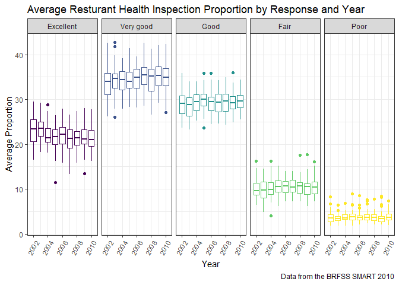

p8105\_hw3\_alc2279
================
Annie Clark
October 6, 2018

Problem 0
=========

This “problem” focuses on structure of your submission, especially the use git and GitHub for reproducibility, R Projects to organize your work, R Markdown to write reproducible reports, relative paths to load data from local files, and reasonable naming structures for your files.

To that end:

-   create a public GitHub repo + local R Project; we suggest naming this repo / directory p8105\_hw3\_YOURUNI (e.g. p8105\_hw3\_ajg2202 for Jeff), but that’s not required
-   create a single .Rmd file named p8105\_hw3\_YOURUNI.Rmd that renders to github\_document

Your solutions to Problems 1, 2, and 3 should be implemented in your .Rmd file, and your git commit history should reflect the process you used to solve these Problems.

For this Problem, we will assess adherence to the instructions above regarding repo structure, git commit history, and whether we are able to knit your .Rmd to ensure that your work is reproducible. Adherence to appropriate styling and clarity of code will be assessed in Problems 1+ using the homework style rubric.

This homework includes figures; the readability of your embedded plots (e.g. font sizes, axis labels, titles) will be assessed in Problems 1+.

``` r
library(tidyverse)
```

    ## -- Attaching packages ------------------------------------------------------ tidyverse 1.2.1 --

    ## v ggplot2 3.0.0     v purrr   0.2.5
    ## v tibble  1.4.2     v dplyr   0.7.6
    ## v tidyr   0.8.1     v stringr 1.3.1
    ## v readr   1.1.1     v forcats 0.3.0

    ## -- Conflicts --------------------------------------------------------- tidyverse_conflicts() --
    ## x dplyr::filter() masks stats::filter()
    ## x dplyr::lag()    masks stats::lag()

``` r
library(p8105.datasets)

theme_set(theme_bw() + theme(legend.position = "bottom"))
```

Problem 1
=========

Part 1: Load and tidy the data
------------------------------

This problem uses the BRFSS data. DO NOT include this dataset in your local data directory; instead, load the data from the p8105.datasets package.

First, do some data cleaning:

-   format the data to use appropriate variable names;
-   focus on the “Overall Health” topic
-   include only responses from “Excellent” to “Poor”
-   organize responses as a factor taking levels from “Excellent” to “Poor”

``` r
brfss_data = brfss_smart2010 %>% 
  janitor::clean_names() %>% 
  rename(state = locationabbr, state_county = locationdesc, proportion = data_value) %>% 
  filter(topic == "Overall Health", 
         response %in% c("Excellent", "Very good", "Good", "Fair", "Poor")) %>% 
  select(-(class:question), -(confidence_limit_low:geo_location)) %>% 
  mutate(response = forcats::fct_relevel(response)) %>% 
  arrange(response)

##don't actually need to filter by responses because when you group by, you see that the only response for overall health are excellent through poor, but keeping this in case the data changes and it is still a requirement by collaborators

  
##Question - only include excellent through poor? those are the only responses?
##Question - does 'organize as factor...' mean to recode as a factor and then arrange in ascending order?
```

Part 2: Answer some questions
-----------------------------

Using this dataset, do or answer the following (commenting on the results of each):

-   In 2002, which states were observed at 7 locations?

``` r
brfss_data %>% 
  filter(year == "2002") %>% 
  group_by(state) %>% 
  summarize(n_locations = n_distinct(state_county)) %>% 
  filter(n_locations == 7) %>% 
  pull(state)
```

    ## [1] "CT" "FL" "NC"

-   Make a “spaghetti plot” that shows the number of observations in each state from 2002 to 2010.

``` r
##brfss_data %>% 
  ##group_by(state) %>% 
  ##summarize(n_observations = n()) %>% 
  ggplot(brfss_data, aes(x = year, y = sample_size, color = state)) + 
    geom_line()
```


``` r
##Question - wut. is going on with this graph.
```

-   Make a table showing, for the years 2002, 2006, and 2010, the mean and standard deviation of the proportion of “Excellent” responses across locations in NY State.

``` r
brfss_data %>% 
  group_by(state_county) %>% 
  filter(year %in% c("2002", "2006", "2010"),
         state == "NY",
         response == "Excellent") %>%
  summarize(excellent_mean = mean(proportion, na.rm = TRUE), 
            excellent_sd = sd(proportion, na.rm = TRUE))
```

    ## # A tibble: 9 x 3
    ##   state_county            excellent_mean excellent_sd
    ##   <chr>                            <dbl>        <dbl>
    ## 1 NY - Bronx County                 17.6      NaN    
    ## 2 NY - Erie County                  17.2      NaN    
    ## 3 NY - Kings County                 20.4        1.77 
    ## 4 NY - Monroe County                22.4      NaN    
    ## 5 NY - Nassau County                24.9        2.82 
    ## 6 NY - New York County              27.5        1.54 
    ## 7 NY - Queens County                19.6        1.36 
    ## 8 NY - Suffolk County               24.1        3.28 
    ## 9 NY - Westchester County           26.4        0.636

``` r
##Question - group by location and year or just location?
##pulling back NaN because there is only one point estimate; cannot calculate sd?
```

-   For each year and state, compute the average proportion in each response category (taking the average across locations in a state). Make a five-panel plot that shows, for each response category separately, the distribution of these state-level averages over time.

``` r
brfss_data %>% 
  group_by(year, state, response) %>% 
  summarize(response_mean = mean(proportion, na.rm = TRUE)) %>% 
  ##spread(key = response, value = response_mean) %>% 
  ggplot(aes(x = year, y = response_mean, color = response)) + 
    geom_line(alpha = .5) +
    facet_grid(~response)
```



``` r
  ##  geom_boxplot()
  

##Question - clarify what they're actually asking? did i do it?
```

Problem 2
=========

Part 1: Load the data
---------------------

This problem uses the Instacart data. DO NOT include this dataset in your local data directory; instead, load the data from the p8105.datasets package (it’s called instacart).

``` r
instacart_data = instacart
```

Part 2: EDA - Describe the data
-------------------------------

### Prompt

The goal is to do some exploration of this dataset. To that end, write a short description of the dataset, noting the size and structure of the data, describing some key variables, and giving illstrative examples of observations.

### Response

Part 3: EDA - Some questions
----------------------------

Then, do or answer the following (commenting on the results of each):

-   How many aisles are there, and which aisles are the most items ordered from?

``` r
instacart_data %>% 
  distinct(aisle) %>% ##confirmed that aisles are distinct
  nrow()
```

    ## [1] 134

``` r
instacart_data %>% 
  group_by(aisle) %>% 
  summarize(n_items = n()) %>% 
  arrange(desc(n_items)) %>% 
  pull(aisle) %>% 
  head(5)
```

    ## [1] "fresh vegetables"           "fresh fruits"              
    ## [3] "packaged vegetables fruits" "yogurt"                    
    ## [5] "packaged cheese"

-   Make a plot that shows the number of items ordered in each aisle. Order aisles sensibly, and organize your plot so others can read it.

``` r
instacart_data %>% 
  group_by(aisle) %>% 
  summarize(n_items = n()) %>% 
  arrange(desc(n_items)) %>% 
  ggplot(aes(x = n_items)) + 
    geom_histogram()
```

    ## `stat_bin()` using `bins = 30`. Pick better value with `binwidth`.


``` r
##Question - what type of plot? are we supposed to be able to show the name of the aisle and also how many items were ordered from it?
```

-   Make a table showing the most popular item aisles “baking ingredients”, “dog food care”, and “packaged vegetables fruits”

``` r
instacart_data %>% 
  filter(aisle %in% c("baking ingredients", 
                      "dog food care", 
                      "packaged vegetables fruits")) %>%
  group_by(aisle) %>% 
  summarize(n_items = n())
```

    ## # A tibble: 3 x 2
    ##   aisle                      n_items
    ##   <chr>                        <int>
    ## 1 baking ingredients           13088
    ## 2 dog food care                 1612
    ## 3 packaged vegetables fruits   78493

``` r
##Question - do we need to add anything else but n to the table?
```

-   Make a table showing the mean hour of the day at which Pink Lady Apples and Coffee Ice Cream are ordered on each day of the week; format this table for human readers (i.e. produce a 2 x 7 table).

``` r
instacart_data %>% 
  group_by(product_name, order_dow) %>% 
  ##mutate(recode(order_dow, mon = 0, tue = 1, wed = 2, thu = 4, fri = 5, sat = 5, sun = 6)) %>% 
  filter(product_name %in% c("Pink Lady Apple", "Coffee Ice Cream")) %>%
  summarize(hour_of_day_mean = mean(order_hour_of_day, na.rm = TRUE)) %>% 
  spread(key = order_dow, value = hour_of_day_mean)
```

    ## # A tibble: 2 x 8
    ## # Groups:   product_name [2]
    ##   product_name       `0`   `1`   `2`   `3`   `4`   `5`   `6`
    ##   <chr>            <dbl> <dbl> <dbl> <dbl> <dbl> <dbl> <dbl>
    ## 1 Coffee Ice Cream  13.8  14.3  15.4  15.3  15.2  12.3  13.8
    ## 2 Pink Lady Apple   14.4  14.2  13.2   8    11    16    13

``` r
##dow starts at monday? doesn't run if i recode dows
```

Problem 3
=========

Part 1: Load the data
---------------------

This problem uses the NY NOAA data. DO NOT include this dataset in your local data directory; instead, load the data from the p8105.datasets package (it’s called ny\_noaa).

``` r
noaa_data = ny_noaa
```

Part 2: EDA - Describe the data
-------------------------------

### Prompt

The goal is to do some exploration of this dataset. To that end, write a short description of the dataset, noting the size and structure of the data, describing some key variables, and indicating the extent to which missing data is an issue.

### Response

Part 3: EDA - Answer some questions
-----------------------------------

Then, do or answer the following (commenting on the results of each):

-   Do some data cleaning. Create separate variables for year, month, and day. Ensure observations for temperature, precipitation, and snowfall are given in reasonable units. For snowfall, what are the most commonly observed values? Why?

-   Make a two-panel plot showing the average temperature in January and in July in each station across years. Is there any observable / interpretable structure? Any outliers?

-   Make a two-panel plot showing (i) tmax vs tmin for the full dataset (note that a scatterplot may not be the best option); and (ii) make a plot showing the distribution of snowfall values greater than 0 and less than 100 separately by year.
